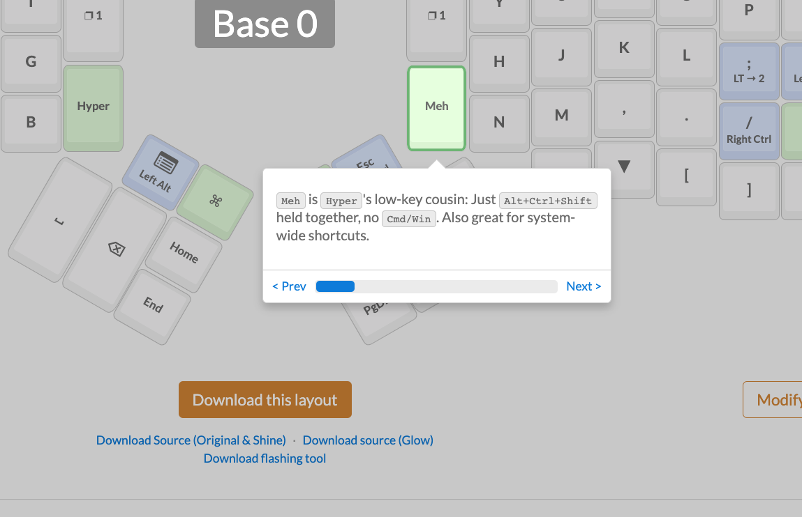
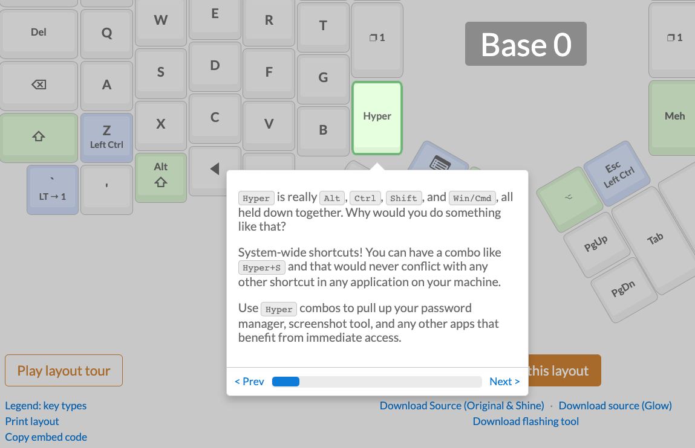

# Ergodox

[Oryx Lyaout Example](https://configure.ergodox-ez.com/ergodox-ez/layouts/lAN7e/latest)

## References

- [Documentation](https://docs.qmk.fm/#/)
- [Ergodox flavours](https://github.com/qmk/qmk_firmware/tree/master/keyboards/ergodox_ez)

- [Macros](https://docs.qmk.fm/#/feature_macros)
- [Layers](https://docs.qmk.fm/#/feature_layers)

# Supported Keyboards

* [ErgoDox EZ](/ergodox/)

## Key References

- [Key Configuration](https://docs.qmk.fm/#/config_options?id=the-configh-file)
- [Rules MK file](https://docs.qmk.fm/#/config_options?id=the-rulesmk-file)

## Online Connfigurators

- [Oryx](https://configure.ergodox-ez.com/ergodox-ez/layouts/default/latest/0)

## Flasher Toolls

- [Wally](https://ergodox-ez.com/pages/wally)
- [Teensy](https://www.pjrc.com/teensy/teensy31.html)

## Similar Keyboards

- [Dactyl](https://github.com/adereth/dactyl-keyboard)
- [Advantage2](https://kinesis-ergo.com/shop/advantage2/)
- [Iris Split](https://keeb.io/collections/iris-split-ergonomic-keyboard/products/iris-keyboard-split-ergonomic-keyboard)

## Youtube

- [Iris Split](youtube.com/watch?v=0P6oIOB-whM)

## TODO

- [ ] Keyboard Lvl1-3 left key jump back
- [ ] Mac key buggy

## Cables

- https://switchandclick.com/2020/01/11/custom-usb-cables-for-your-keyboard
- [Amazon XLR Cable](https://www.amazon.co.uk/Mechanical-Keyboard-Connector-Paracord-Advanced-Gradient-purple/dp/B086C9W43J/ref=sr_1_1?dchild=1&keywords=Custom%2BCoiled%2BType%2BC%2BUSB%2BCable%2Bfor%2BMechanical%2BKeyboard%2BXLR%2BConnector%2BSpiral%2BParacord%2B80cm%2BAdvanced%2BVersion%2B(Gradient%2BPurple)&linkCode=gs3&linkId=0c48ad9507a4c308f65c233755554f8d&qid=1607185505&quartzVehicle=819-211&replacementKeywords=custom%2Bcoiled%2Btype%2Bc%2Busb%2Bcable%2Bfor%2Bmechanical%2Bkeyboard%2Bconnector%2Bspiral%2Bparacord%2B80cm%2Badvanced%2Bversion%2B(gradient%2Bpurple)&sr=8-1&tag=kbuk0f-21&th=1)

## KeyCaps

- [Hot Keys Project](https://www.hotkeysproject.com/)
- [Amazon Green/Purple](https://www.amazon.co.uk/Sunzit-Backlight-Two-Color-Mechanical-Keyboard/dp/B07TKKTRCV/ref=pd_sbs_23_7?_encoding=UTF8&pd_rd_i=B07TKKTRCV&pd_rd_r=6fd16dfa-3c11-4399-b667-5b541c233ce7&pd_rd_w=q6ofd&pd_rd_wg=hd4vv&pf_rd_p=2304238d-df78-4b25-a9a0-b27dc7bd722e&pf_rd_r=NXDP5E2D2J7MDRVFW14N&psc=1&refRID=NXDP5E2D2J7MDRVFW14N)

## Tech ^ Geeks

- [GeekSocial](https://www.geeksocial.net/)
- [Keyboard Peripherals](https://keybumps.com/products/usb-cables.html)
